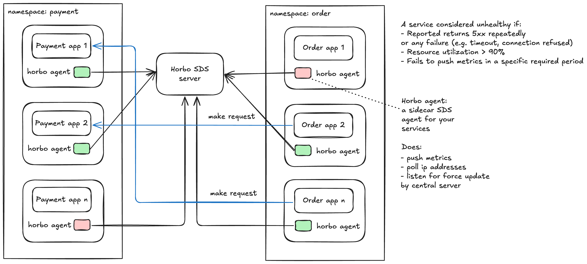
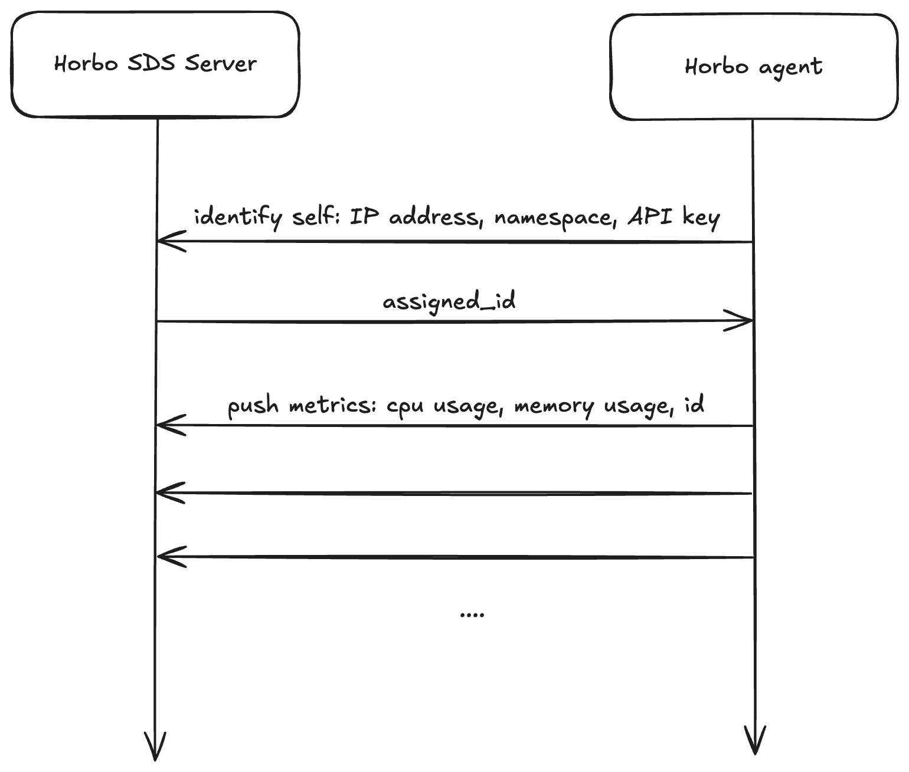
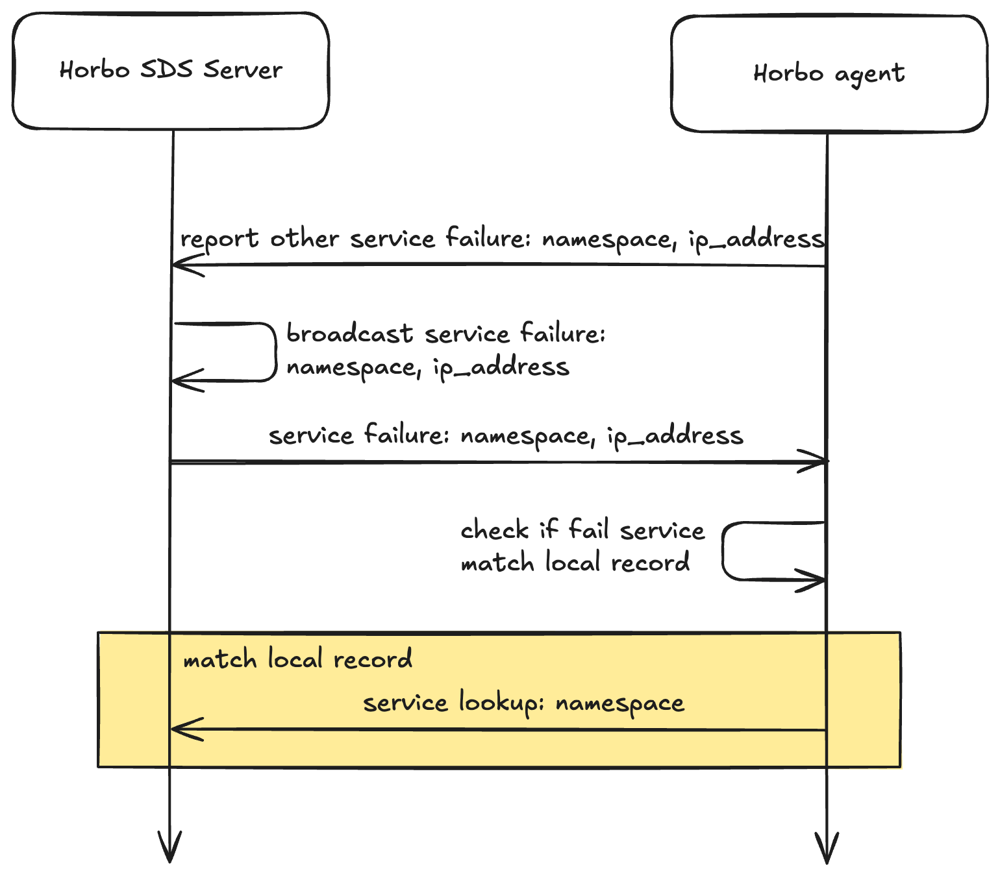
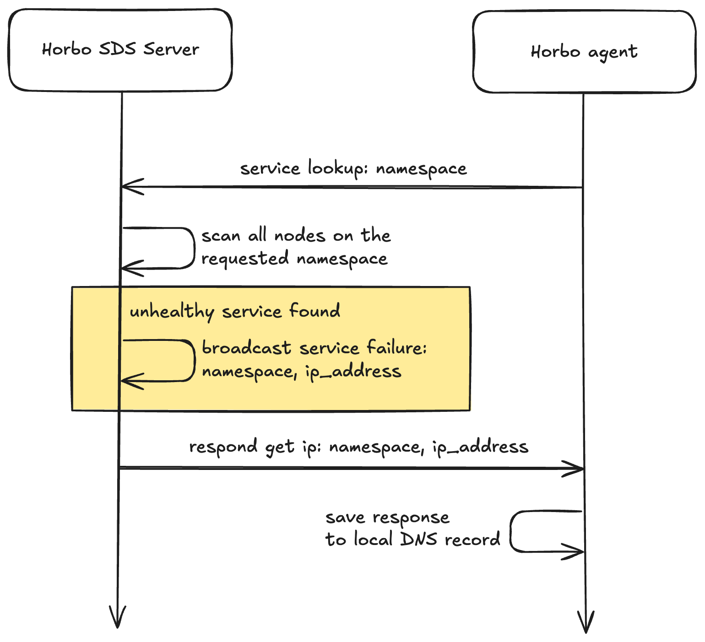

# 📘 System Design: Horbo

<em>Horbo SDS</em>

This document outlines the main flows of the **Horbo** service discovery system, along with their visual diagrams.

---

## 1. 📝 Register Service Flow

<em>Figure 1: Service Registration Flow</em>

---

## 2. ❌ Service Failure Flow

<em>Figure 2: Handling Service Failure</em>

---

## 3. 🔍 Service Lookup Flow

<em>Figure 3: Consistent Hashing Lookup</em>

---

## 📁 Notes

- Make sure all images are placed in the `./assets/images` folder and use snake case naming.
- Use clear naming for each PNG/SVG to keep things organized.
- Diagrams can be made in tools like [Excalidraw](https://excalidraw.com), [Lucidchart](https://www.lucidchart.com), or [draw.io](https://draw.io).

